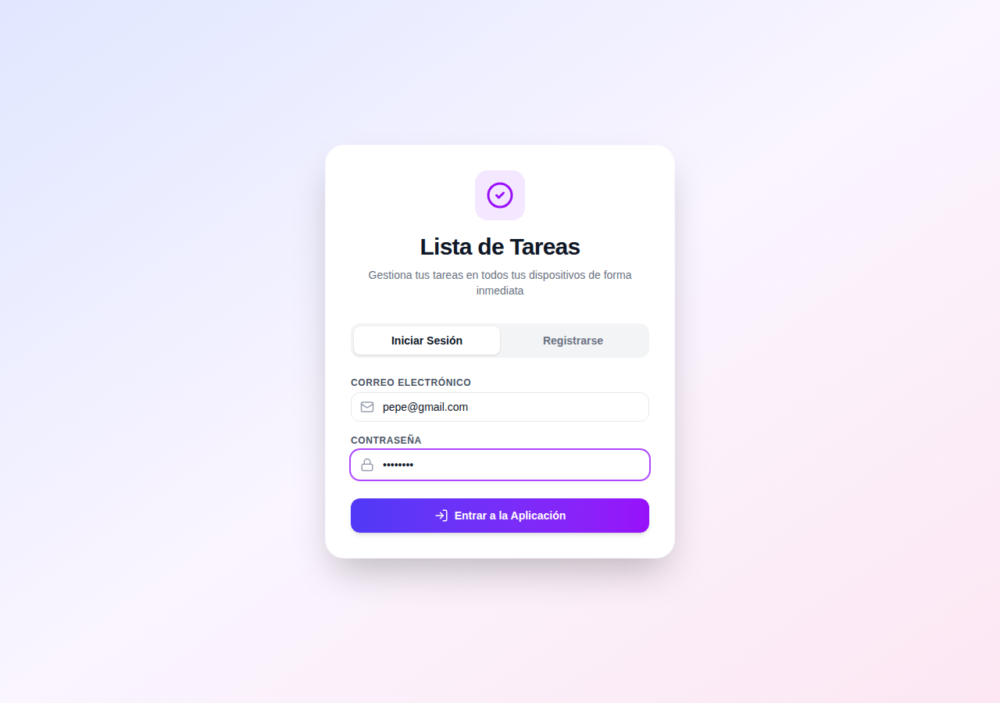
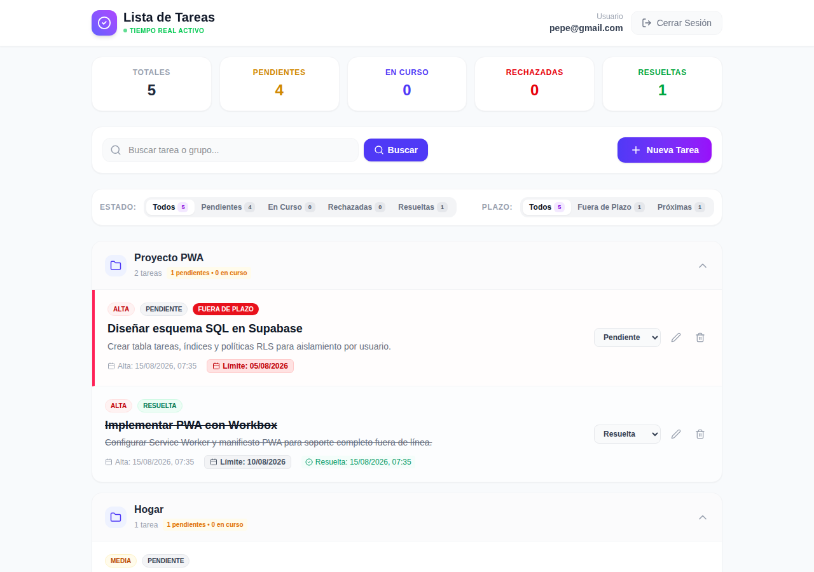
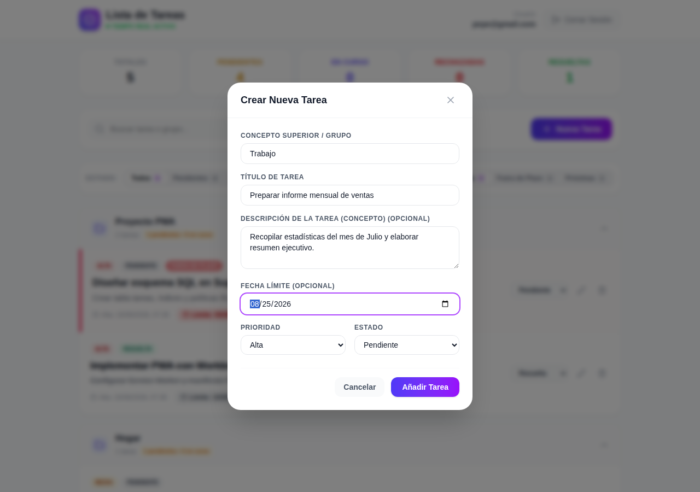
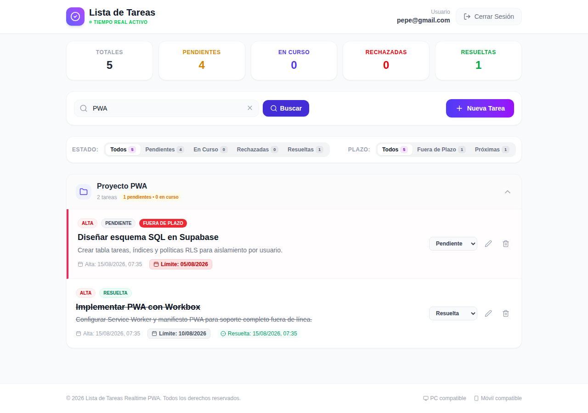

# Lista de Tareas — Progressive Web App (PWA) con Supabase en Tiempo Real

Una aplicación web progresiva (PWA) moderna, rápida y responsiva para la gestión de tareas personales y profesionales. Construida con **React 19**, **TypeScript**, **Vite**, **Tailwind CSS v4** y **Supabase**, ofrece sincronización de datos en tiempo real (WebSockets) y aislamiento de privacidad mediante seguridad a nivel de fila (RLS).

---

## 📋 Tabla de Contenidos

- [Descripción Funcional](#-descripción-funcional)
  - [Características Principales](#características-principales)
  - [Gestión y Agrupación de Tareas](#gestión-y-agrupación-de-tareas)
  - [Estados, Prioridades y Control de Plazos](#estados-prioridades-y-control-de-plazos)
  - [Filtros y Búsqueda Avanzada](#filtros-y-búsqueda-avanzada)
- [🖼️ Vistas de la Aplicación](#️-vistas-de-la-aplicación)
  - [1. Autenticación y Registro](#1-autenticación-y-registro)
  - [2. Panel Principal (Dashboard) y Acordeones](#2-panel-principal-dashboard-y-acordeones)
  - [3. Creación y Edición de Tareas (Modal)](#3-creación-y-edición-de-tareas-modal)
  - [4. Búsqueda y Filtros Multidimensionales](#4-búsqueda-y-filtros-multidimensionales)
- [⚙️ Capítulo Técnico](#️-capítulo-técnico)
  - [Arquitectura y Stack Tecnológico](#arquitectura-y-stack-tecnológico)
  - [Modelo de Base de Datos y Seguridad (RLS)](#modelo-de-base-de-datos-y-seguridad-rls)
  - [Sincronización en Tiempo Real (Realtime WebSockets)](#sincronización-en-tiempo-real-realtime-websockets)
  - [Configuración PWA y Funcionamiento Offline](#configuración-pwa-y-funcionamiento-offline)
- [🚀 Guía de Instalación y Uso](#-guía-de-instalación-y-uso)
  - [Acceso y Privacidad](#acceso-y-privacidad)
  - [Cómo Instalar como PWA (Móvil y PC)](#cómo-instalar-como-pwa-móvil-y-pc)
  - [Desarrollo Local y Despliegue](#desarrollo-local-y-despliegue)

---

## 💡 Descripción Funcional

La aplicación **Lista de Tareas** está diseñada para proporcionar una experiencia fluida y organizada en cualquier dispositivo (ordenadores de escritorio, tabletas y teléfonos móviles).

### Características Principales
- **Sincronización Multi-dispositivo en Tiempo Real**: Cualquier cambio realizado en un dispositivo se refleja instantáneamente en todos los demás dispositivos donde se tenga la sesión abierta sin necesidad de recargar la página.
- **Privacidad y Aislamiento**: Cada usuario cuenta con un espacio privado protegido mediante contraseña. Las tareas de un usuario no son accesibles por ningún otro usuario.
- **Soporte PWA (Progressive Web App)**: Se puede instalar directamente en la pantalla de inicio de Android, iOS o PC como una aplicación nativa.

### Gestión y Agrupación de Tareas
- **Organización por Grupos/Categorías (Concepto Superior)**: Las tareas se agrupan automáticamente según su grupo (ej. *Trabajo*, *Hogar*, *Proyecto PWA*). Cada grupo cuenta con un panel desplegable (acordeón colapsable) para mantener una vista limpia.
- **Autocompletado de Grupos**: Al crear una nueva tarea, el campo del grupo ofrece un autocompletado inteligente con los grupos previamente creados.
- **Descripción Opcional**: Toda tarea cuenta con un título obligatorio y una descripción detallada (concepto) opcional.

### Estados, Prioridades y Control de Plazos
- **Niveles de Prioridad**:
  - 🔴 **Alta**: Para tareas críticas o de mayor urgencia.
  - 🟡 **Media**: Para tareas de prioridad estándar.
  - 🔵 **Baja**: Para tareas secundarias.
- **Estados de Tarea**:
  - `Pendiente`: Tareas recién creadas o por comenzar.
  - `En Curso`: Tareas actualmente en desarrollo.
  - `Resuelta`: Tareas completadas (se registra automáticamente la fecha y hora exacta de resolución).
  - `Rechazada`: Tareas descartadas o canceladas.
- **Semáforo de Plazos (Fecha Límite)**:
  - 🚨 **Fuera de Plazo (Rojo)**: La fecha límite ha pasado y la tarea no está resuelta. Destaca con animación de pulso.
  - ⚠️ **Próxima a Vencer (Amarillo)**: Quedan 5 días o menos para alcanzar la fecha límite.
  - ⚪ **Normal**: Tarea en plazo correcto o sin fecha límite asignada.

### Filtros y Búsqueda Avanzada
- **Búsqueda Manual**: Permite buscar por coincidencias en el título, la descripción, el grupo o términos clave de plazo (ej. "vencida", "próxima").
- **Filtros por Estado**: Con un clic permite filtrar la lista por `Pendientes`, `En Curso`, `Rechazadas` o `Resueltas`.
- **Filtros por Plazo**: Acceso rápido para ver únicamente tareas `Fuera de Plazo` o `Próximas`.
- **Resumen Estadístico**: Panel superior interactivo con contadores dinámicos del total de tareas y desglose por estado.

---

## 🖼️ Vistas de la Aplicación

### 1. Autenticación y Registro
Pantalla inicial de inicio de sesión y registro. Permite a los usuarios identificarse de forma segura o crear una cuenta nueva.



---

### 2. Panel Principal (Dashboard) y Acordeones
El panel principal presenta las métricas del usuario (Totales, Pendientes, En Curso, Rechazadas y Resueltas) y la lista de tareas organizadas en grupos desplegables.



---

### 3. Creación y Edición de Tareas (Modal)
Formulario flotante centrado para añadir nuevas tareas o modificar las existentes. Permite seleccionar grupo con autocompletado, título, descripción opcional, fecha límite, prioridad y estado.



---

### 4. Búsqueda y Filtros Multidimensionales
Demostración del motor de búsqueda y filtrado de la aplicación reduciendo el listado al grupo o término buscado.



---

## ⚙️ Capítulo Técnico

### Arquitectura y Stack Tecnológico

La aplicación utiliza una arquitectura moderna basada en componentes y tecnologías cliente-servidor desacopladas:

- **Frontend**:
  - **React 19**: Biblioteca UI para renders reactivos eficientes.
  - **TypeScript**: Tipado estático estricto para modelos de datos e interfaces UI.
  - **Vite 8**: Herramienta de compilación rápida con HMR (Hot Module Replacement) y generación de paquetes de producción optimizados.
  - **Tailwind CSS v4**: Framework CSS para un diseño ágil y totalmente responsivo.
  - **Lucide React**: Conjunto de iconos vectoriales ligeros.
- **Backend & Persistencia**:
  - **Supabase**: Plataforma Backend-as-a-Service basada en **PostgreSQL**.
  - **Supabase Auth**: Sistema de autenticación JWT gestionado.
  - **Supabase Realtime**: Motor WebSockets para transmisión de eventos en la base de datos (`INSERT`, `UPDATE`, `DELETE`).

---

### Modelo de Base de Datos y Seguridad (RLS)

La persistencia de datos reside en una tabla PostgreSQL llamada `tareas`. El archivo `schema.sql` contiene la estructura completa:

```sql
CREATE TABLE IF NOT EXISTS public.tareas (
    id UUID PRIMARY KEY DEFAULT gen_random_uuid(),
    user_id UUID NOT NULL REFERENCES auth.users(id) ON DELETE CASCADE DEFAULT auth.uid(),
    titulo TEXT NOT NULL DEFAULT 'Sin título',
    concepto TEXT NOT NULL,
    concepto_superior TEXT NOT NULL,
    prioridad TEXT NOT NULL CHECK (prioridad IN ('alta', 'media', 'baja')),
    estado TEXT NOT NULL DEFAULT 'pendiente' CHECK (estado IN ('pendiente', 'en curso', 'rechazada', 'resuelta')),
    fecha_alta TIMESTAMPTZ NOT NULL DEFAULT timezone('utc'::text, now()),
    fecha_resolucion TIMESTAMPTZ,
    fecha_limite DATE
);

-- Índice de rendimiento para filtrar por usuario
CREATE INDEX IF NOT EXISTS tareas_user_id_idx ON public.tareas(user_id);
```

#### Seguridad a Nivel de Fila (Row Level Security - RLS)
Para garantizar la máxima privacidad de los usuarios, la tabla `tareas` tiene activada la seguridad RLS. Cada fila se evalúa mediante la función `auth.uid() = user_id`, impidiendo que ningún usuario consulte, modifique o borre registros pertenecientes a otro identificador.

```sql
ALTER TABLE public.tareas ENABLE ROW LEVEL SECURITY;

CREATE POLICY "Permitir lectura a usuarios de sus propias tareas"
ON public.tareas FOR SELECT TO authenticated
USING (auth.uid() = user_id);

CREATE POLICY "Permitir inserción a usuarios de sus propias tareas"
ON public.tareas FOR INSERT TO authenticated
WITH CHECK (auth.uid() = user_id);

CREATE POLICY "Permitir actualización a usuarios de sus propias tareas"
ON public.tareas FOR UPDATE TO authenticated
USING (auth.uid() = user_id) WITH CHECK (auth.uid() = user_id);

CREATE POLICY "Permitir borrado a usuarios de sus propias tareas"
ON public.tareas FOR DELETE TO authenticated
USING (auth.uid() = user_id)
USING (auth.uid() = user_id);
```

---

### Sincronización en Tiempo Real (Realtime WebSockets)

La aplicación utiliza la publicación de eventos de Supabase Realtime para sincronizar automáticamente cualquier cambio en la tabla de tareas:

```typescript
const channel = supabase
  .channel('realtime:tareas')
  .on(
    'postgres_changes',
    {
      event: '*',
      schema: 'public',
      table: 'tareas',
      filter: `user_id=eq.${user.id}`
    },
    (payload) => {
      if (payload.eventType === 'INSERT') { ... }
      if (payload.eventType === 'UPDATE') { ... }
      if (payload.eventType === 'DELETE') { ... }
    }
  )
  .subscribe();
```

---

### Configuración PWA y Funcionamiento Offline

Gracias al plugin `vite-plugin-pwa` integrado con **Workbox**:
- **Manifiesto Web (`manifest.webmanifest`)**: Define el nombre de la app, colores del tema, iconos adaptativos e instrucciones de visualización en pantalla completa (`display: standalone`).
- **Service Worker (`sw.js`)**: Realiza precaché de los recursos estáticos (HTML, CSS, JS, fuentes e iconos) e implementa la estrategia de desinstalación/reemplazo de cachés obsoletas (`cleanupOutdatedCaches: true`).

---

## 🚀 Guía de Instalación y Uso

### Acceso y Privacidad

1. **Registro Inicial**:
   - Para comenzar a utilizar la aplicación, es necesario registrarse introduciendo un correo electrónico y una contraseña.
   - **Nota sobre Privacidad**: La dirección de correo electrónico se utiliza únicamente como un identificador único de usuario para crear tu espacio de almacenamiento aislado y asignarle una clave criptográfica de sesión. No se requiere verificación previa si está deshabilitada en la instancia de Supabase.

2. **Acceso**:
   - Una vez registrada la cuenta, puedes iniciar sesión desde cualquier teléfono, tablet u ordenador. Tus tareas estarán siempre sincronizadas al instante.

---

### Cómo Instalar como PWA (Móvil y PC)

Puedes añadir la **Lista de Tareas** como un acceso directo o aplicación nativa en tu dispositivo siguiendo estos sencillos pasos:

#### 📱 En iPhone / iPad (iOS & iPadOS)
1. Abre la aplicación en el navegador **Safari**.
2. Pulsa el botón **Compartir** (icono del cuadrado con una flecha hacia arriba en la barra inferior).
3. Desplázate hacia abajo en el menú y selecciona **Añadir a la pantalla de inicio**.
4. Confirma el nombre de la aplicación y pulsa **Añadir**. El icono de la app aparecerá en tu pantalla de inicio.

#### 🤖 En Android (Chrome, Edge, Brave)
1. Abre la aplicación en **Google Chrome** u otro navegador compatible.
2. Pulsa el menú de opciones (los tres puntos verticales en la esquina superior derecha).
3. Selecciona la opción **Añadir a la pantalla de inicio** o **Instalar aplicación**.
4. Pulsa **Instalar** para confirmar.

#### 💻 En PC / Mac (Chrome, Edge)
1. Abre la app en tu navegador de escritorio.
2. En la barra de direcciones, pulsa sobre el icono de **Instalar aplicación** (pantalla con flecha) o ve al menú de tres puntos > **Guardar y compartir** > **Instalar página como aplicación**.

---

### Desarrollo Local y Despliegue

#### Requisitos Previos
- **Node.js**: Versión 18 o superior.
- **npm** o **yarn**.

#### Pasos para Desarrollo Local
1. **Clonar el repositorio**:
   ```bash
   git clone https://github.com/tu-usuario/todo.git
   cd todo
   ```

2. **Instalar dependencias**:
   ```bash
   npm install
   ```

3. **Iniciar el servidor de desarrollo**:
   ```bash
   npm run dev
   ```

4. **Compilar para producción**:
   ```bash
   npm run build
   ```

5. **Desplegar en GitHub Pages**:
   ```bash
   npm run deploy
   ```
